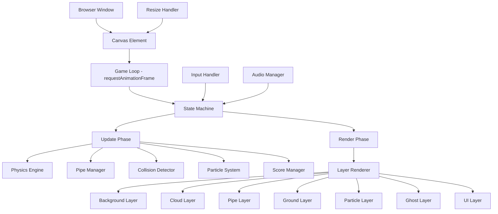
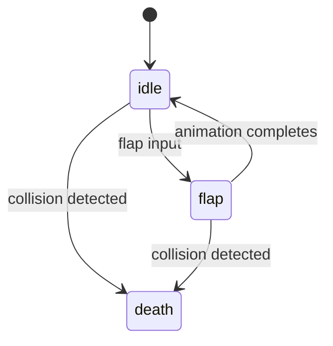

# Design Document: Flappy Kiro

## Overview

Flappy Kiro is a single-file browser-based HTML5 canvas game implemented in vanilla JavaScript. The player controls a ghost character that must navigate through gaps between scrolling pipe pairs. The architecture follows a traditional game loop pattern with frame-independent physics using delta-time calculations.

The game is delivered as a single `index.html` file containing all markup, styles, and JavaScript logic. External dependencies are limited to the asset files (sprites and audio). This zero-dependency approach ensures instant loading and simple deployment.

### Key Design Decisions

1. **Single-file architecture**: All game code lives in one HTML file for simplicity and portability. No build tools or bundling required.
2. **Logical coordinate system**: The game operates in a fixed logical coordinate space (e.g., 400×600) that maps to physical pixels via a scale factor. This decouples game logic from screen resolution.
3. **State machine**: Game flow is managed by a simple state machine with three states: `idle`, `running`, and `gameover`.
4. **requestAnimationFrame loop**: The game loop uses `requestAnimationFrame` with delta-time calculations to ensure smooth, frame-rate-independent gameplay.
5. **Object pooling for particles**: Particle trail elements are reused from a pool to avoid garbage collection pressure during gameplay.

## Architecture

The game follows a layered architecture within a single script context:



### Game Loop Flow

```mermaid
sequenceDiagram
    participant RAF as requestAnimationFrame
    participant Loop as Game Loop
    participant State as State Machine
    participant Update as Update Phase
    participant Render as Render Phase

    RAF->>Loop: callback(timestamp)
    Loop->>Loop: Calculate deltaTime
    Loop->>Loop: Clamp deltaTime (0, 0.05s)
    Loop->>State: Get current state
    alt state == running
        Loop->>Update: update(deltaTime)
        Update->>Update: Apply gravity
        Update->>Update: Move pipes
        Update->>Update: Check collisions
        Update->>Update: Update particles
        Update->>Update: Check scoring
    end
    Loop->>Render: render()
    Render->>Render: Draw layers back-to-front
    Loop->>RAF: Request next frame
```

## Components and Interfaces

### 1. GameState (State Machine)

Manages transitions between game states.

```typescript
type GameState = 'idle' | 'running' | 'gameover';

interface GameStateManager {
  current: GameState;
  gameOverTimestamp: number | null;
  transition(newState: GameState): void;
  canRestart(): boolean; // true if 500ms have passed since game-over
}
```

### 2. Ghost (Player Character)

Manages the ghost's position, velocity, rendering, and sprite animation.

```typescript
type GhostAnimState = 'idle' | 'flap' | 'death';

interface GhostSprite {
  image: HTMLImageElement;
  frameWidth: 32;         // Sprite sheet frame width (px)
  frameHeight: 32;        // Sprite sheet frame height (px)
  animations: {
    idle: { frames: [0, 1]; frameDuration: 300 };   // 2 frames, gentle bob
    flap: { frames: [2, 3, 4]; frameDuration: 80 }; // 3 frames, wing flap
    death: { frames: [5]; frameDuration: 0 };        // 1 frame, static
  };
  currentFrame: number;
  elapsedFrameTime: number;
  currentAnim: GhostAnimState;
}

interface Ghost {
  x: number;           // Horizontal position (fixed, left-third of canvas)
  y: number;           // Vertical position (logical pixels)
  vy: number;          // Vertical velocity (px/s, time-based)
  width: 32;           // Sprite width (logical pixels)
  height: 32;          // Sprite height (logical pixels)
  hitboxRadius: 12;    // Circular hitbox radius (logical pixels)
  sprite: GhostSprite;
  
  flap(): void;        // Set vy to -300 px/s
  applyGravity(dt: number): void;    // vy += 800 * dt
  updatePosition(dt: number): void;  // y += vy * dt
  clampToCanvas(canvasHeight: number, groundHeight: number): void;
  getHitbox(): Circle;  // Returns circular hitbox for collision
  updateAnimation(dt: number): void;
  setAnimState(state: GhostAnimState): void;
  reset(canvasWidth: number, canvasHeight: number): void;
}
```

### 3. PipeManager

Handles pipe pair generation, movement, and cleanup.

```typescript
interface PipePair {
  x: number;           // Horizontal position
  gapCenterY: number;  // Vertical center of the gap
  gapHeight: number;   // Fixed at 140 logical pixels
  width: number;       // Fixed at 50 logical pixels
  scored: boolean;     // Whether this pipe has been counted for scoring
}

interface PipeManager {
  pipes: PipePair[];
  spawnSpacing: number;  // 350 logical pixels
  baseSpeed: number;     // 120 px/s (time-based)
  currentSpeed: number;  // Increases with score
  maxSpeed: number;      // 300 px/s
  
  update(dt: number, score: number): void;
  spawn(canvasWidth: number, canvasHeight: number, groundHeight: number): void;
  removeOffscreen(): void;
  getSpeed(score: number): number;  // baseSpeed + 6 * floor(score / 5), capped at maxSpeed
  reset(): void;
}
```

### 4. CollisionDetector

Checks for circle-vs-AABB overlap between the ghost's circular hitbox and pipe/ground rectangles.

```typescript
interface Rect {
  x: number;
  y: number;
  width: number;
  height: number;
}

interface Circle {
  cx: number;   // Center x
  cy: number;   // Center y
  radius: number;  // 12px for ghost
}

interface CollisionDetector {
  checkPipeCollision(ghost: Circle, pipe: PipePair): boolean;
  checkGroundCollision(ghost: Circle, groundY: number): boolean;
  circleRectOverlap(circle: Circle, rect: Rect): boolean;
}
```

### 5. ParticleSystem

Manages particle trail effects behind the ghost.

```typescript
interface Particle {
  x: number;
  y: number;
  radius: number;       // 2-4 pixels
  opacity: number;      // Starts at 0.6, decays to 0
  life: number;         // Remaining life in ms (starts at 500)
  maxLife: number;      // 500ms
}

interface ParticleSystem {
  particles: Particle[];
  frameCounter: number;  // Emit every 3 frames
  
  update(dtMs: number): void;
  emit(ghostX: number, ghostY: number, ghostHeight: number): void;
  reset(): void;
}
```

### 6. ScoreManager

Handles scoring, popups, and high score persistence.

```typescript
interface ScorePopup {
  x: number;
  y: number;
  opacity: number;      // 1.0 to 0.0
  offsetY: number;      // Animates up by 30px
  life: number;         // 800ms duration
}

interface ScoreManager {
  current: number;
  high: number;
  popups: ScorePopup[];
  
  increment(ghostX: number, ghostY: number): void;
  loadHighScore(): number;
  saveHighScore(): void;
  updatePopups(dtMs: number): void;
  reset(): void;
}
```

### 7. AudioManager

Preloads and plays audio assets with autoplay policy compliance.

```typescript
interface SoundConfig {
  name: string;
  file: string;
  duration: number;    // seconds
  volume: number;
  allowOverlap: boolean;  // short sounds can overlap
}

interface AudioManager {
  sounds: Map<string, HTMLAudioElement>;
  soundConfigs: {
    flap: { file: 'jump.wav', duration: 0.1, volume: 0.5, allowOverlap: true };
    score: { file: 'score.wav', duration: 0.2, volume: 0.6, allowOverlap: true };
    collision: { file: 'game_over.wav', duration: 0.3, volume: 0.7, allowOverlap: false };
  };
  musicPlaying: boolean;
  userInteracted: boolean;
  
  preload(): Promise<void>;
  play(name: string): void;          // Clones audio node for overlapping short sounds
  playExclusive(name: string): void; // Interrupts other sounds (collision)
  startMusic(): void;
  stopMusic(): void;
  resumeMusic(): void;
  handleInteraction(): void;  // Unlock audio context on first input
}
```

### 8. ScreenShake

Applies random displacement to the rendering offset on collision.

```typescript
interface ScreenShake {
  active: boolean;
  duration: number;     // 300ms
  elapsed: number;
  offsetX: number;
  offsetY: number;
  
  trigger(): void;
  update(dtMs: number): void;
  getOffset(): { x: number; y: number };
  reset(): void;
}
```

### 9. CloudManager

Manages parallax cloud decorations at varying speeds and opacities.

```typescript
interface Cloud {
  x: number;
  y: number;
  width: number;
  height: number;
  speed: number;        // 15 to 60 px/s (time-based)
  opacity: number;      // Correlated with speed: slower = lower opacity
}

interface CloudManager {
  clouds: Cloud[];
  
  initialize(canvasWidth: number, canvasHeight: number, groundHeight: number): void;
  update(dt: number): void;
  reset(canvasWidth: number, canvasHeight: number, groundHeight: number): void;
}
```

### 10. ResizeHandler

Manages responsive canvas sizing and coordinate scaling.

```typescript
interface ResizeHandler {
  logicalWidth: number;   // Fixed logical width (e.g., 400)
  logicalHeight: number;  // Fixed logical height (e.g., 600)
  scale: number;          // Physical pixels per logical pixel
  offsetX: number;        // Letterbox offset X
  offsetY: number;        // Letterbox offset Y
  
  handleResize(): void;
  logicalToPhysical(lx: number, ly: number): { x: number; y: number };
  getScale(): number;
}
```

### 11. UIManager

Manages menu screens, HUD elements, and game-over overlay rendering.

```typescript
interface UIManager {
  // Menu state
  menuVisible: boolean;
  pulsePhase: number;      // For pulsing text animation
  
  // HUD
  renderHUD(ctx: CanvasRenderingContext2D, score: number, highScore: number): void;
  
  // Main menu
  renderMainMenu(ctx: CanvasRenderingContext2D, highScore: number): void;
  
  // Game over
  renderGameOver(
    ctx: CanvasRenderingContext2D,
    finalScore: number,
    highScore: number,
    isNewHighScore: boolean,
    elapsedMs: number   // Time since game-over (for restart prompt visibility)
  ): void;
  
  // Helpers
  renderPulsingText(ctx: CanvasRenderingContext2D, text: string, x: number, y: number): void;
  update(dt: number): void;  // Update pulse animation
}
```

## Data Models

### Game Constants

```javascript
const CONFIG = {
  // Logical coordinate space
  LOGICAL_WIDTH: 400,
  LOGICAL_HEIGHT: 600,
  MIN_CANVAS_WIDTH: 300,
  MIN_CANVAS_HEIGHT: 400,
  
  // Ghost (time-based physics)
  GHOST_X_RATIO: 0.25,        // Position at 25% from left
  GHOST_WIDTH: 32,             // Sprite width (px)
  GHOST_HEIGHT: 32,            // Sprite height (px)
  GHOST_HITBOX_RADIUS: 12,    // Circular hitbox radius (px)
  FLAP_VELOCITY: -300,        // px/s (upward)
  GRAVITY: 800,               // px/s² (downward)
  MAX_FALL_SPEED: 600,        // px/s
  MAX_RISE_SPEED: -720,       // px/s
  MAX_DELTA_TIME: 0.05,       // seconds (clamp)
  
  // Ghost Animation
  SPRITE_FRAME_WIDTH: 32,     // px per frame in sprite sheet
  SPRITE_FRAME_HEIGHT: 32,    // px per frame in sprite sheet
  ANIM_IDLE_FRAMES: [0, 1],
  ANIM_IDLE_FRAME_DURATION: 300,   // ms per frame
  ANIM_FLAP_FRAMES: [2, 3, 4],
  ANIM_FLAP_FRAME_DURATION: 80,    // ms per frame
  ANIM_DEATH_FRAMES: [5],
  ANIM_DEATH_FRAME_DURATION: 0,    // static
  
  // Pipes (time-based physics)
  PIPE_WIDTH: 50,
  GAP_HEIGHT: 140,             // px (gap between top and bottom pipe)
  SPAWN_SPACING: 350,          // px (horizontal distance between pipe pairs)
  MIN_PIPE_HEIGHT: 50,
  BASE_PIPE_SPEED: 120,       // px/s
  MAX_PIPE_SPEED: 300,        // px/s
  SPEED_INCREMENT: 6,         // px/s per 5 points
  SCORE_INTERVAL: 5,          // points per speed increase
  
  // Ground
  GROUND_HEIGHT: 60,
  
  // Particles
  PARTICLE_EMIT_INTERVAL: 3,  // frames
  PARTICLE_LIFESPAN: 500,     // ms
  PARTICLE_MIN_RADIUS: 2,
  PARTICLE_MAX_RADIUS: 4,
  PARTICLE_INITIAL_OPACITY: 0.6,
  PARTICLE_OFFSET_RANGE: 3,   // pixels vertical randomness
  
  // Clouds
  CLOUD_COUNT_MIN: 3,
  CLOUD_COUNT_MAX: 6,
  CLOUD_MIN_SPEED: 15,        // px/s
  CLOUD_MAX_SPEED: 60,        // px/s
  CLOUD_MIN_OPACITY: 0.3,
  CLOUD_MAX_OPACITY: 0.7,
  
  // Screen Shake
  SHAKE_DURATION: 300,        // ms
  SHAKE_INTENSITY: 5,         // pixels
  
  // Score Popup
  POPUP_DURATION: 800,        // ms
  POPUP_RISE: 30,             // pixels
  
  // Audio
  MUSIC_VOLUME: 0.3,
  SOUND_FLAP_DURATION: 0.1,       // seconds
  SOUND_SCORE_DURATION: 0.2,      // seconds
  SOUND_COLLISION_DURATION: 0.3,  // seconds
  
  // Game Over
  RESTART_DELAY: 500,         // ms before restart is allowed
  
  // Colors
  COLOR_SKY: '#87CEEB',
  COLOR_GROUND: '#1a1a3e',
  COLOR_PIPE: '#2ecc40',
  COLOR_CLOUD: '#ffffff',
  COLOR_UI_BG: 'rgba(0, 0, 0, 0.7)',
  COLOR_UI_TEXT: '#ffffff',
  COLOR_UI_ACCENT: '#FFD700',
};
```

### Game State Structure

```javascript
const gameState = {
  state: 'idle',              // 'idle' | 'running' | 'gameover'
  ghost: { x, y, vy },
  pipes: [],                  // Array of PipePair
  particles: [],              // Array of Particle
  scorePopups: [],            // Array of ScorePopup
  clouds: [],                 // Array of Cloud
  score: 0,
  highScore: 0,
  gameOverTime: null,         // timestamp when game-over started
  shake: { active, elapsed, offsetX, offsetY },
  lastTimestamp: null,        // for delta-time calculation
  frameCount: 0,             // for particle emit interval
};
```

### localStorage Schema

| Key | Type | Description |
|-----|------|-------------|
| `flappyKiro_highScore` | string (numeric) | Persisted high score value |

Retrieval: `parseInt(localStorage.getItem('flappyKiro_highScore'), 10) || 0`

## Character Sprite Specifications

### Sprite Sheet Layout

The ghost character uses a horizontal sprite sheet (`ghosty.png`) with the following layout:

| Frame Index | State | Description |
|-------------|-------|-------------|
| 0 | idle-1 | Neutral pose, wings resting |
| 1 | idle-2 | Slight bob, wings slightly raised |
| 2 | flap-1 | Wings beginning upstroke |
| 3 | flap-2 | Wings at full extension (apex) |
| 4 | flap-3 | Wings completing downstroke |
| 5 | death | Eyes closed, wings drooped |

### Dimensions and Hitbox

- **Sprite frame size:** 32×32 pixels (logical)
- **Sprite sheet total size:** 192×32 pixels (6 frames × 32px)
- **Hitbox type:** Circular (forgiving, matches ghost's round shape)
- **Hitbox radius:** 12 pixels (centered on sprite)
- **Hitbox center offset:** (16, 16) relative to sprite top-left corner

The circular hitbox is intentionally smaller than the visual sprite bounds to provide a forgiving collision feel. The 12px radius inscribes within the 32×32 sprite, leaving a 4px buffer on each side.

### Animation Timing

| State | Frames | Duration per Frame | Loop |
|-------|--------|--------------------|------|
| idle | 0, 1 | 300ms | Yes |
| flap | 2, 3, 4 | 80ms | No (returns to idle after completion) |
| death | 5 | — | No (holds frame) |

### Animation Transitions



- On flap input: immediately switch to `flap` animation from frame 2
- On flap animation completion: return to `idle` from frame 0
- On collision: immediately switch to `death` (frame 5) and hold

## Sound Design

### Sound Effects

| Sound | File | Duration | Description | Trigger |
|-------|------|----------|-------------|---------|
| Flap | `jump.wav` | 0.1s | Short whoosh, soft high-frequency sweep | Player provides flap input during running state |
| Score | `score.wav` | 0.2s | Pleasant chime, two ascending tones | Ghost passes pipe trailing edge |
| Collision | `game_over.wav` | 0.3s | Soft thud, low-frequency impact | Ghost collides with pipe or ground |

### Audio Characteristics

- **Flap sound (0.1s):** A brief upward frequency sweep (800Hz → 1200Hz) with fast attack and immediate decay. Volume: 0.5. Should feel responsive and lightweight.
- **Score sound (0.2s):** Two quick ascending notes (C5 → E5) with a bell-like timbre. Volume: 0.6. Should feel rewarding but not disruptive.
- **Collision sound (0.3s):** A low thud (200Hz) with brief white noise burst. Volume: 0.7. Should feel impactful but not harsh.

### Background Music

- **File:** `background_music.mp3`
- **Volume:** 0.3 (ambient, non-intrusive)
- **Loop:** Continuous during running state
- **Behavior:** Pauses on game-over, resumes from beginning on restart

### Audio Playback Rules

1. All sounds are preloaded on page load
2. Short sounds (flap, score) use cloned Audio nodes to allow overlapping playback
3. Collision sound interrupts any currently playing flap/score sounds
4. Background music defers to first user interaction (autoplay policy compliance)
5. Failed audio loads emit `console.warn` and gameplay continues without that sound

## UI/Interface Design

### Main Menu (Idle State)

```
┌─────────────────────────────────────┐
│                                     │
│            ☁         ☁              │
│                                     │
│                                     │
│          ╔═══════════════╗          │
│          ║  FLAPPY KIRO  ║          │
│          ╚═══════════════╝          │
│                                     │
│             👻 (ghost)              │
│          (idle animation)           │
│                                     │
│         ┌──────────────┐            │
│         │  ▶  PLAY     │            │
│         └──────────────┘            │
│         ┌──────────────┐            │
│         │  🏆 HIGH: 42 │            │
│         └──────────────┘            │
│                                     │
│      Tap or click to start          │
│                                     │
│▓▓▓▓▓▓▓▓▓▓▓▓▓▓▓▓▓▓▓▓▓▓▓▓▓▓▓▓▓▓▓▓▓│ ← Ground
└─────────────────────────────────────┘
```

**Layout Details:**
- Title: "FLAPPY KIRO" in pixel-style font, centered at ~30% from top
- Ghost character: displayed centered, playing idle animation
- Play button: centered, 160×40px logical, rounded corners, green fill (#2ecc40)
- High score display: centered below play button, 160×40px, semi-transparent background
- Instruction text: "Tap or click to start" — centered, pulsing opacity (0.5 ↔ 1.0, 1s cycle)
- Both tap/click on canvas OR pressing spacebar starts the game

### In-Game HUD (Running State)

```
┌─────────────────────────────────────┐
│                                     │
│                                     │
│      (gameplay area)                │
│           👻→                       │
│                     ┃   ┃           │
│                     ┃   ┃           │
│                     ┃   ┃           │
│                         gap         │
│                     ┃   ┃           │
│                     ┃   ┃           │
│                     ┃   ┃           │
│                                     │
│                                     │
│▓▓▓▓▓▓▓▓▓▓▓▓▓▓▓▓▓▓▓▓▓▓▓▓▓▓▓▓▓▓▓▓▓│
│  Score: 7              High: 42    │
└─────────────────────────────────────┘
```

**Layout Details:**
- Score display: bottom-left of canvas, inside/overlapping the ground strip
- High score display: bottom-right of canvas, same vertical position as score
- Font: 16px monospace (logical), white text with dark shadow for readability
- Format: `Score: {current}` and `High: {high}`
- Score popup "+1": appears at ghost position, floats up 30px, fades over 800ms

### Game Over Screen (Game-Over State)

```
┌─────────────────────────────────────┐
│                                     │
│    (frozen gameplay scene behind)   │
│                                     │
│    ┌───────────────────────────┐    │
│    │                           │    │
│    │       GAME OVER           │    │
│    │                           │    │
│    │     Final Score: 12       │    │
│    │     Best Score:  42       │    │
│    │                           │    │
│    │   🏆 New High Score!      │    │ ← (shown conditionally)
│    │                           │    │
│    │  Tap or click to restart  │    │
│    │                           │    │
│    └───────────────────────────┘    │
│                                     │
│▓▓▓▓▓▓▓▓▓▓▓▓▓▓▓▓▓▓▓▓▓▓▓▓▓▓▓▓▓▓▓▓▓│
│  Score: 12             High: 42    │
└─────────────────────────────────────┘
```

**Layout Details:**
- Overlay: semi-transparent dark background (rgba(0, 0, 0, 0.7)) covering the play area
- Game Over panel: centered, ~280×200px logical, rounded corners, dark background with subtle border
- "GAME OVER" text: centered, 24px bold, white
- Final score: centered, 18px, white
- Best score: centered, 18px, gold (#FFD700) if it's a new high score
- "New High Score!" badge: shown only when current score > previous high score, with gold text and a subtle glow
- Restart prompt: "Tap or click to restart" — pulsing opacity, 14px, shown after 500ms delay
- Input is ignored for the first 500ms after game-over to prevent accidental restarts

### UI Rendering Layer Order

The UI elements are rendered in the following order (back to front):

1. Background color (sky)
2. Clouds (sorted slowest to fastest)
3. Pipe pairs
4. Ground strip
5. Particle trail
6. Ghost sprite
7. Score popup (+1 animation)
8. Score display (HUD)
9. Game-over overlay (when applicable)
10. Menu elements (when in idle state)

## Correctness Properties

*A property is a characteristic or behavior that should hold true across all valid executions of a system — essentially, a formal statement about what the system should do. Properties serve as the bridge between human-readable specifications and machine-verifiable correctness guarantees.*

### Property 1: Flap velocity override

*For any* ghost with any current vertical velocity (positive, negative, or zero), when a flap input occurs, the resulting vertical velocity SHALL be exactly -300 px/s.

**Validates: Requirements 2.1, 2.2, 3.7**

### Property 2: Delta-time clamping

*For any* raw elapsed time value (including negative values, zero, very large values, and NaN-adjacent edge cases), the computed delta-time SHALL be clamped to the range [0, 0.05] seconds.

**Validates: Requirements 3.1**

### Property 3: Gravity application

*For any* ghost vertical velocity and any valid delta-time (dt in [0, 0.05]s), the new velocity after one frame of gravity SHALL equal the previous velocity plus (800 × dt), before clamping is applied.

**Validates: Requirements 3.2**

### Property 4: Position update

*For any* ghost vertical position and velocity, and any valid delta-time (dt in [0, 0.05]s), the new position after one frame SHALL equal the previous position plus (velocity × dt).

**Validates: Requirements 3.3**

### Property 5: Velocity clamping invariant

*For any* ghost vertical velocity after physics updates (gravity application and/or flap), the clamped velocity SHALL always be within the range [-720, 600] px/s.

**Validates: Requirements 3.4, 3.5**

### Property 6: Top-edge boundary clamping

*For any* ghost whose position update results in a y-coordinate less than 0, the position SHALL be clamped to 0 and the vertical velocity SHALL be set to 0.

**Validates: Requirements 3.8**

### Property 7: Pipe speed scaling

*For any* non-negative integer score, the pipe speed SHALL equal min(120 + 6 × floor(score / 5), 300) px/s.

**Validates: Requirements 4.5**

### Property 8: Pipe offscreen cleanup

*For any* pipe pair whose x-position plus pipe width is less than 0, that pipe pair SHALL be removed from the active pipes array after the cleanup step.

**Validates: Requirements 4.6**

### Property 9: Gap position bounds

*For any* generated pipe pair given a canvas height and ground height, the gap center Y SHALL be positioned such that the top pipe has at least 50 pixels of height AND the bottom pipe has at least 50 pixels of height above the ground. The gap height is fixed at 140px.

**Validates: Requirements 4.2**

### Property 10: Circle-vs-AABB collision correctness

*For any* circle (cx, cy, radius=12) and axis-aligned rectangle (x, y, width, height), the collision function SHALL return true if and only if the closest point on the rectangle to the circle center is within the circle's radius.

**Validates: Requirements 5.1, 5.2**

### Property 11: Score increments exactly once per pipe

*For any* sequence of frames where the ghost passes a pipe's trailing edge, the score SHALL increment by exactly 1 for that pipe, and subsequent frames where the ghost remains past the same pipe SHALL not increment the score again.

**Validates: Requirements 6.1, 6.2**

### Property 12: Score popup animation decay

*For any* score popup with elapsed time t in [0, 800] milliseconds, the opacity SHALL equal (1 - t/800) and the vertical offset SHALL equal 30 × (t/800) pixels upward.

**Validates: Requirements 6.5**

### Property 13: High score persistence logic

*For any* pair of (currentScore, storedHighScore), the game SHALL write to localStorage if and only if currentScore > storedHighScore. Additionally, *for any* localStorage value that is null, undefined, or non-numeric, loadHighScore SHALL return 0.

**Validates: Requirements 7.2, 7.4**

### Property 14: Screen shake linear decay

*For any* elapsed time t in [0, 300] milliseconds after shake activation, the shake intensity multiplier SHALL equal (1 - t/300), producing offsets in the range [-5 × multiplier, 5 × multiplier] on both axes.

**Validates: Requirements 8.3**

### Property 15: Restart delay enforcement

*For any* elapsed time since game-over began, restart SHALL be permitted if and only if elapsed time ≥ 500 milliseconds.

**Validates: Requirements 8.5, 8.6**

### Property 16: Cloud initialization invariants

*For any* initialized set of clouds: the count SHALL be between 3 and 6 inclusive, each cloud's speed SHALL be in [15, 60] px/s, each cloud's opacity SHALL be in [0.3, 0.7], and *for any* two clouds A and B where A.speed > B.speed, it SHALL hold that A.opacity ≥ B.opacity.

**Validates: Requirements 9.3, 9.5**

### Property 17: Particle opacity decay

*For any* particle with elapsed time t in [0, 500] milliseconds since creation, the opacity SHALL equal 0.6 × (1 - t/500). When t ≥ 500, the particle SHALL be removed.

**Validates: Requirements 9.8**

### Property 18: Responsive scaling preserves aspect ratio

*For any* viewport dimensions (width, height) above the minimum thresholds (300×400), the computed scale factor and letterbox offsets SHALL produce a play area with the fixed logical aspect ratio (400:600), and all game elements SHALL be scaled by the same factor (canvasHeight / logicalHeight).

**Validates: Requirements 10.2, 10.3**

## Error Handling

### Audio Failures

- If any audio file fails to load (network error, 404, corrupt file), the game continues without that sound. A `console.warn` is emitted.
- If `Audio.play()` throws (e.g., due to autoplay restrictions), the error is caught silently and the game continues.
- The `AudioManager` wraps all play calls in try/catch to prevent audio issues from crashing the game loop.

### localStorage Failures

- If `localStorage.getItem` throws (private browsing mode in some browsers), the high score defaults to 0.
- If `localStorage.setItem` throws (storage full, private mode), the error is caught and the high score update is skipped silently.
- Non-numeric or corrupted values are handled via `parseInt(...) || 0` fallback.

### Asset Loading Failures

- If `ghosty.png` fails to load, the game renders a fallback colored rectangle as the ghost placeholder.
- The game waits for the sprite image `onload` event before starting the game loop to prevent rendering blank sprites.

### Frame Rate Issues

- Delta-time is clamped to a maximum of 0.05 seconds (50ms). If a frame takes longer (e.g., browser tab was backgrounded), the game skips physics rather than allowing the ghost to teleport through pipes.
- A delta-time of 0 or negative is clamped to 0, resulting in no physics update for that frame.

### Browser Compatibility

- The game uses standard Canvas 2D API and `requestAnimationFrame`, supported in all modern browsers.
- Touch events are registered alongside mouse and keyboard events for mobile compatibility.
- The resize handler uses a debounce approach (or immediate recalculation) to avoid excessive reflows.

## Testing Strategy

### Unit Tests (Example-Based)

Unit tests cover specific scenarios, initialization behavior, and rendering format:

- Game initializes in 'idle' state with ghost at correct position
- Flap inputs are ignored in game-over state before 500ms delay
- Score display formats correctly ("Score: X", "High: X")
- Game-over overlay shows final score and restart prompt
- Render layer order is correct (back-to-front)
- Audio elements configured with correct properties (loop, volume)
- Minimum canvas size enforced below 300×400 viewport
- Game state preserved on resize

### Property-Based Tests

Property-based tests validate universal correctness properties using the **fast-check** library (JavaScript PBT framework). Each test runs a minimum of **100 iterations** with randomly generated inputs.

**Library:** [fast-check](https://github.com/dubzzz/fast-check)

**Configuration:**
- Minimum 100 iterations per property
- Each test tagged with: `Feature: flappy-kiro, Property {N}: {title}`

**Properties to implement:**

1. Flap velocity override — generate random velocities, verify flap always produces -300 px/s
2. Delta-time clamping — generate arbitrary numbers, verify output in [0, 0.05]
3. Gravity application — generate (vy, dt) pairs, verify newVy = vy + 800 * dt
4. Position update — generate (y, vy, dt) triples, verify newY = y + vy * dt
5. Velocity clamping — generate arbitrary velocities, verify clamped to [-720, 600] px/s
6. Top-edge clamping — generate positions where y < 0, verify y → 0 and vy → 0
7. Pipe speed scaling — generate scores 0-150, verify speed formula: min(120 + 6 * floor(score/5), 300)
8. Pipe offscreen cleanup — generate pipe arrays with some x + width < 0, verify removal
9. Gap position bounds — generate (canvasHeight, groundHeight), verify gap constraints with 140px gap
10. Circle-vs-AABB collision — generate circle and rect pairs, verify overlap logic matches closest-point definition
11. Score once per pipe — generate frame sequences, verify single increment
12. Score popup decay — generate elapsed times [0, 800], verify opacity and offset formulas
13. High score persistence — generate (current, high) pairs + invalid localStorage values
14. Screen shake decay — generate elapsed times [0, 300], verify intensity formula
15. Restart delay — generate elapsed times, verify boolean matches >= 500ms check
16. Cloud initialization — generate parameters, verify count/speed/opacity bounds and correlation
17. Particle opacity decay — generate elapsed times [0, 500], verify opacity formula
18. Responsive scaling — generate viewport sizes, verify aspect ratio and uniform scaling

### Integration Tests

- Audio playback fires on correct game events (with mocked Audio API)
- localStorage read/write integration with browser storage
- Canvas resize handler responds to window resize events
- requestAnimationFrame loop drives correct update/render cycle

### Manual Testing

- Visual verification of sprite rendering, cloud parallax, particle effects
- Touch input responsiveness on mobile devices
- Audio playback timing and volume across browsers
- Screen shake visual feel and duration

